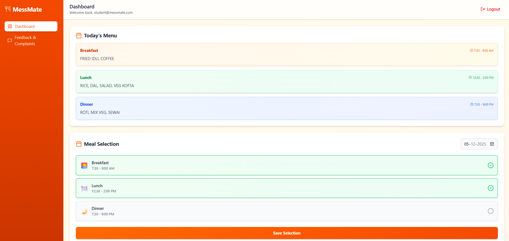
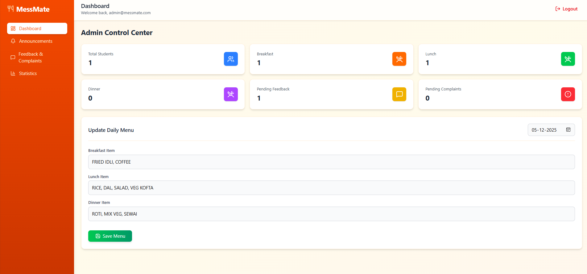

# MessMate 🍽️


> **Tackling Food Wastage in College Hostels.**

A modern full-stack web application that synchronizes student demand with kitchen supply, eliminating the guesswork in mess operations.

---

### 🚀 **[View Live Demo](https://mess-mate-gamma.vercel.app)**

---

## 📸 Screenshots

| Student Dashboard | Admin Dashboard |
|:---:|:---:|
|  |  |

## 🧐 The Problem
Every day, kilograms of fresh food are wasted in hostels because kitchen staff have to **guess** attendance. 
- If 50 students skip dinner, that food is dumped.
- **MessMate** solves this by allowing students to mark "Not Eating" in advance, giving the kitchen an exact real-time headcount.

## ✨ Features

- **Student Dashboard**: 
  - 📅 View daily menu
  - ❌ Mark meal availability (Eating/Not Eating)
  - 💬 Submit feedback
- **Admin Dashboard**: 
  - 📊 **Real-time Headcount** for Breakfast, Lunch, & Dinner
  - 📝 Update daily menu items instantly
- **Technical Highlights**:
  - **Real-time Sync**: Menu & stats update instantly across devices (Firestore).
  - **Security**: Role-based Authentication via Firebase Auth.
  - **Performance**: Built on React 19 & Vite for near-instant loads.
- **Responsive Design**:
  - Works seamlessly on desktop and mobile devices
  
## 🛠 Tech Stack

- **Frontend**: React 19, Vite
- **Styling**: Tailwind CSS 4
- **Backend**: Firebase (Authentication, Firestore)
- **Routing**: React Router DOM
- **UI Components**: Lucide React icons
- **Notifications**: React Hot Toast

## Getting Started

### Prerequisites

- Node.js (v18 or higher)
- npm or yarn
- Firebase project

### Installation

1. Clone the repository
2. Install dependencies:
   ```bash
   npm install
   ```

3. Set up environment variables:
   - Create `.env`
   - Fill in your Firebase configuration credentials

4. Start the development server:
   ```bash
   npm run dev
   ```

5. Open your browser and navigate to `http://localhost:5173`

## Project Structure

```
mess-app/
├── assets/
├── src/
│   ├── components/       # Reusable UI components
│   │   ├── layout/      # Layout components (DashboardLayout)
│   │   └── ui/          # UI components (buttons, cards, etc.)
│   ├── config/          # Configuration files (Firebase)
│   ├── context/         # React Context providers (AuthContext)
│   ├── hooks/           # Custom React hooks
│   ├── pages/           # Page components
│   │   ├── admin/       # Admin dashboard pages
│   │   ├── auth/        # Authentication pages
│   │   └── student/     # Student dashboard pages
│   ├── services/        # API/service layer (Firebase operations)
│   ├── utils/           # Utility functions
│   ├── App.jsx          # Main app component with routing
│   ├── main.jsx         # Entry point
│   └── index.css        # Global styles (Tailwind)
├── public/              # Static assets
└── package.json         # Dependencies and scripts
```

## Firebase Setup

1. Create a Firebase project at [Firebase Console](https://console.firebase.google.com/)
2. Enable Authentication (Email/Password)
3. Create a Firestore database
4. Create a collection named `mess` with a document `daily_menu`
5. Copy your Firebase config to `.env` file

## Development

```bash
# Run development server
npm run dev

# Build for production
npm run build

# Preview production build
npm run preview

# Lint code
npm run lint
```

## Environment Variables

Make sure to set these in your `.env` file:

- `VITE_FIREBASE_API_KEY`
- `VITE_FIREBASE_AUTH_DOMAIN`
- `VITE_FIREBASE_PROJECT_ID`
- `VITE_FIREBASE_STORAGE_BUCKET`
- `VITE_FIREBASE_MESSAGING_SENDER_ID`
- `VITE_FIREBASE_APP_ID`

## 📬 Contact

Created by **[Mukund Gupta](https://in.linkedin.com/in/mukund-gupta-)** 

Check out the [Live Demo](https://mess-mate-gamma.vercel.app) or view my other projects on [GitHub](https://github.com/mukundgupta72).

---